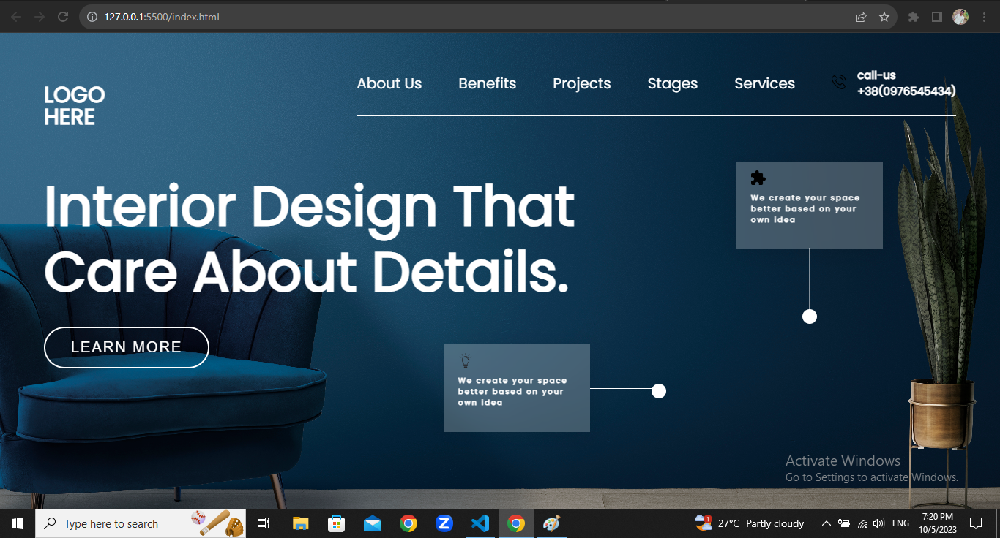

# Project-10 HTML & CSS Full Stack Javascript Web Development Course

## About

This project is created using HTML and CSS. I have used CSS Positioning to build this project, and this project is responsive.

## What did I learn by making this project?

-   Learn about posoitioning and using ::after and ::before psudo elements.

## Time taken to finish this project?

This project took me around 5  hours to finish.

## Screenshots

